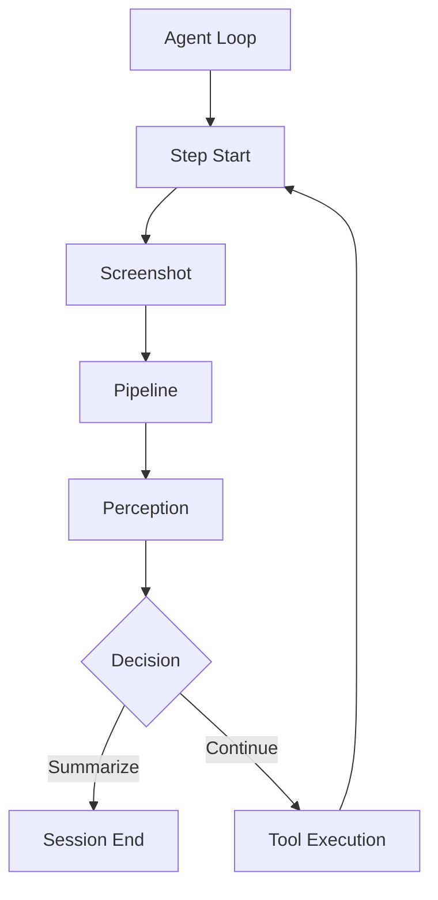

# 🤖 Computer Use Agent

A sophisticated AI agent designed to interact with computer interfaces through natural language commands. The agent combines computer vision, natural language processing, and decision-making capabilities to perform tasks on behalf of users.

## 🏗️ Architecture

### Core Orchestration

#### 1. Agent Loop (`agent/core/loop.py`)
- Main execution loop that orchestrates the entire workflow
- Manages the step-by-step execution of tasks
- Handles retries and error recovery
- Implements limits for steps, retries, and re-analysis attempts
- Coordinates the interaction between all components

#### 2. Context (`agent/core/context.py`)
- Maintains the state of the current session
- Tracks completed and failed steps
- Manages screen analysis and tool execution history
- Provides step management functionality
- Ensures continuity between steps

### Step Execution Flow

Each step in the agent's execution follows this sequence:



#### 1. Screenshot (`pipeline/screenshot.py`)
- Captures current screen state
- Manages screenshot storage and organization
- Handles multi-monitor support
- Provides timestamped image files
- Ensures consistent image capture for analysis

#### 2. Pipeline (`pipeline/pipeline.py`)
- Orchestrates the image processing workflow
- Integrates YOLO object detection
- Manages OCR text recognition
- Handles intelligent bbox merging
- Coordinates Seraphine geometric grouping
- Processes Gemini analysis results
- Generates structured screen analysis

#### 3. Perception (`agent/core/perception.py`)
- Analyzes screen state using the MCP server's Gemini analysis
- Identifies UI elements and their relationships
- Determines the current state of the task
- Routes between decision-making, re-analysis, or summarization
- Provides context-aware analysis

#### 4. Decision (`agent/core/decision.py`)
- Determines the next action based on perception analysis
- Selects appropriate tools for the task
- Generates tool parameters
- Handles error cases and recovery strategies
- Plans next steps

#### 5. Tool Execution
- Executes selected tools through MCP server
- Handles mouse and keyboard control
- Manages window operations
- Performs file operations
- Reports execution results

### Component Integration

The components work together in a tightly integrated workflow:

1. **Initialization**
   - Agent Loop creates a new session
   - Context is initialized with user query
   - Step counter and limits are set

2. **Step Execution**
   - Screenshot captures current state
   - Pipeline processes the image
   - Perception analyzes the results
   - Decision determines next action
   - Tool executes the action
   - Context updates with results

3. **Flow Control**
   - Perception can request re-analysis
   - Decision can trigger tool execution
   - Tool execution can lead to next step
   - Context maintains state throughout

4. **Completion**
   - Session summary is generated
   - Results are logged
   - Outputs are organized

### MCP Server Integration

The agent leverages the MCP (Multi-Computer Protocol) server which provides:

1. **Gemini Analysis**
   - Advanced UI element detection and recognition
   - Text extraction and understanding
   - Spatial relationship analysis
   - Element grouping and categorization

2. **Tool Execution**
   - Mouse and keyboard control
   - Window management
   - Application launching
   - File operations

## 📁 Output Structure

The agent generates detailed outputs for each session:

```
outputs/
└── YYYY/
    └── MM/
        └── DD/
            └── session_YYYYMMDD_HHMMSS/
                ├── step_1/
                │   ├── screenshot_*.jpg
                │   └── pipeline_output.json
                ├── step_2/
                │   ├── screenshot_*.jpg
                │   └── pipeline_output.json
                └── session_summary.json
```

### Session Summary
- Complete task execution history
- Success/failure status
- Tool usage details
- Error information if any

## 🔄 Execution Flow

1. **Task Initialization**
   - User provides natural language task
   - Agent creates new session context
   - Initializes step counter and limits

2. **Perception-Analysis Cycle**
   - Takes screenshot of current state
   - Runs MCP pipeline for analysis
   - Processes Gemini analysis results
   - Updates context with findings

3. **Decision Making**
   - Analyzes current state
   - Selects appropriate tool
   - Generates tool parameters
   - Plans next steps

4. **Tool Execution**
   - Executes selected tool
   - Handles errors and retries
   - Updates context with results

5. **Completion/Summarization**
   - Generates session summary
   - Reports success/failure
   - Provides detailed execution history

## ⚙️ Configuration

### Agent Settings
```python
max_steps = 10      # Maximum steps per session
max_retries = 3     # Maximum retries per step
max_analysis = 1    # Maximum re-analysis attempts per step
```

### MCP Server Settings
- Screen ID configuration
- Tool execution parameters
- Pipeline analysis settings

## 🛠️ Usage

```python
# Initialize agent
agent = ComputerAgentLoop(multi_mcp, model_manager)

# Run task
result = await agent.run("Open notepad, type 'Hello World' and save it as 'hello.txt'")
```

## 📝 Notes

- The agent uses a combination of computer vision and LLM analysis to understand the screen state
- Each step is carefully logged and can be reviewed in the session summary
- Error handling and recovery strategies are built into the execution flow
- The agent maintains context awareness throughout the task execution

## 🔒 Security

- All tool executions are logged and monitored
- Sensitive information is not stored in logs
- Tool execution is sandboxed and controlled

## 🤝 Contributing

Contributions are welcome! Please feel free to submit a Pull Request.

## 📄 License

This project is licensed under the MIT License - see the LICENSE file for details.

---

## 🙏 Acknowledgments

- **YOLO**: Object detection framework
- **PaddleOCR**: Text detection and recognition
- **Google Gemini**: Advanced AI analysis
- **OpenCV**: Computer vision operations
- **PIL/Pillow**: Image processing

---

## 📞 Support

For questions, issues, or contributions:
- **GitHub Issues**: [Create an issue](https://github.com/your-repo/issues)
- **Documentation**: This README
- **Examples**: See `examples/` directory

---

**🚀 Ready to detect, group, and analyze! Happy coding!**

---

## ⚙️ Configuration

### `utils/config.json`
```json
{
    "mode": "debug",                    // "debug" | "deploy_mcp"
    
    // Core Settings
    "save_json": true,
    "save_visualizations": true,
    "generate_grouped_images": true,
    "output_dir": "outputs",
    
    // YOLO Configuration
    "yolo_model_path": "models/model_dynamic.onnx",
    "yolo_conf_threshold": 0.1,
    "yolo_iou_threshold": 0.1,
    "yolo_enable_timing": true,
    "yolo_enable_debug": true,
    
    // OCR Configuration
    "ocr_model_path": "models/ch_PP-OCRv3_det_infer.onnx",
    "ocr_det_threshold": 0.9,
    "ocr_max_side_len": 1280,
    "ocr_enable_timing": true,
    "ocr_enable_debug": true,
    
    // Merging Configuration
    "merger_iou_threshold": 0.05,
    
    // Seraphine Configuration
    "seraphine_timing": false,
    "seraphine_enable_debug": false,
    
    // Gemini Configuration
    "gemini_enabled": true,
    "gemini_prompt_path": "utils/prompt.txt",
    "gemini_return_images_b64": true,
    "gemini_max_concurrent": 4,
    
    // Visualization Settings
    "save_gemini_visualization": true,
    "save_yolo_viz": true,
    "save_ocr_viz": true,
    "save_merged_viz": true,
    "save_complete_viz": true,
    "save_seraphine_viz": true
}
```

---

## 🚀 Usage

### 🐛 Debug Mode (Development)

**Configuration:**
```json
{
    "mode": "debug"
}
```

**Run:**
```bash
uv run main.py
```

**Output:**
```bash
🚀 ENHANCED AI PIPELINE V1.2: Detection + Merging + Seraphine + Gemini + Export
==========================================================================================
✅ Configuration loaded from config.json
🎯 YOLO Config: conf=0.1, iou=0.1
📝 OCR Config: threshold=0.9, max_len=1280
📸 Image loaded: 1920x1080 pixels

🔄 Step 1: Parallel YOLO + OCR Detection + Intelligent Merging (FIXED)
============================================================
⚡ Parallel detection completed in 2.540s
  YOLO found: 124 detections
  OCR found: 78 detections

🧠 Step 2: Seraphine Intelligent Grouping & Layout Analysis
============================================================
📊 Seraphine Grouping Results:
  🧠 Input: 159 merged detections (M001-M159)
  📦 Groups created: 75
  📐 Horizontal groups: 65
  📏 Vertical groups: 10

🤖 Step 4: Gemini LLM Analysis
======================================================================
🤖 GEMINI ANALYSIS SUMMARY:
  📊 Images analyzed: 3/3
  🎯 Total icons found: 154
  ⏱️  Analysis time: 11.85s

📊 ENHANCED PIPELINE V1.2 SUMMARY:
=================================================================
  ⏱️  Total pipeline time: 14.634s
  🤖 GEMINI analysis: ✅ 3/3 images analyzed
     🎯 Total icons found: 154
  💾 Enhanced JSON: word_enhanced_v1_01-06.json
  🎨 Visualizations: 6 types created
```

**Generated Files:**
```bash
outputs/
├── v1_word_yolo_result_11-07.jpg           # YOLO detections
├── v1_word_ocr_result_11-07.jpg            # OCR detections
├── v1_word_merged_result_11-07.jpg         # Merged detections
├── v1_word_complete_result_11-07.jpg       # All detections
├── v1_word_seraphine_groups_11-07.jpg      # Intelligent groups
├── v1_word_gemini_analysis_11-07.jpg       # Gemini labeled
├── word_enhanced_v1_01-06.json             # Complete pipeline data
└── word_gemini_analysis_11-07.json         # Gemini analysis
```

### 🚀 Deploy MCP Mode (Production)

**Configuration:**
```json
{
    "mode": "deploy_mcp"
}
```

**Run:**
```bash
uv run main.py
```

**Output:**
```bash
Pipeline completed in 12.345s, found 154 icons.
```

**Return Data:**
```python
{
    'total_time': 12.345,
    'total_icons_found': 154,
    'seraphine_gemini_groups': {
        'H1_1': {
            'bbox': [10, 20, 100, 30],
            'g_icon_name': 'Weather Widget',
            'g_brief': 'Shows current temperature and weather conditions',
            'm_id': 'M001',
            'y_id': 'Y001',
            'o_id': 'NA'
        },
        'H1_2': {...},
        'V1_1': {...}
        // ... all grouped elements with Gemini analysis
    }
}
```

---

## 🔧 API Reference

### Main Function
```python
import asyncio
from main import main

# Run pipeline
results = asyncio.run(main())

if results:
    # Access results
    if 'seraphine_gemini_groups' in results:
        groups = results['seraphine_gemini_groups']
        total_time = results['total_time']
        icon_count = results['total_icons_found']
    
    # Debug mode additional data
    if 'detection_results' in results:
        yolo_detections = results['detection_results']['yolo_detections']
        ocr_detections = results['detection_results']['ocr_detections']
        merged_detections = results['detection_results']['merged_detections']
```

### Individual Components
```python
from utils.yolo_detector import YOLODetector, YOLOConfig
from utils.ocr_detector import OCRDetector, OCRDetConfig
from utils.bbox_merger import BBoxMerger
from utils.seraphine_processor import FinalSeraphineProcessor
from utils.gemini_integration import run_gemini_analysis

# Initialize detectors
yolo_config = YOLOConfig(
    model_path="models/model_dynamic.onnx",
    conf_threshold=0.1,
    iou_threshold=0.1
)
yolo_detector = YOLODetector(yolo_config)

ocr_config = OCRDetConfig(
    model_path="models/ch_PP-OCRv3_det_infer.onnx",
    det_threshold=0.9,
    max_side_len=1280
)
ocr_detector = OCRDetector(ocr_config)

# Run detections
yolo_results = yolo_detector.detect("image.jpg")
ocr_results = ocr_detector.detect("image.jpg")

# Merge results
merger = BBoxMerger()
merged_results, stats = merger.merge_detections(yolo_results, ocr_results)

# Group with Seraphine
processor = FinalSeraphineProcessor()
seraphine_analysis = processor.analyze(merged_results)

# Analyze with Gemini
gemini_results = await run_gemini_analysis(seraphine_analysis, grouped_images, "image.jpg", config)
```

---

## 📊 Output Format

### Debug Mode Return
```python
{
    'detection_results': {
        'yolo_detections': [...],      # Raw YOLO detections
        'ocr_detections': [...],       # Raw OCR detections  
        'merged_detections': [...],    # Intelligently merged
        'timing': {...},               # Performance metrics
        'merge_stats': {...}           # Merge statistics
    },
    'seraphine_analysis': {
        'analysis': {...},             # Group statistics
        'seraphine_gemini_groups': {...} # Final grouped data
    },
    'gemini_results': {
        'total_icons_found': 154,     # Total icons
        'analysis_duration_seconds': 11.85,
        'successful_analyses': 3,
        'icons': [...]                 # Detailed icon data
    },
    'grouped_image_paths': [...],      # Generated group images
    'visualization_paths': {...},     # All visualization files
    'json_path': "outputs/enhanced.json",
    'config': {...},                   # Used configuration
    'total_time': 14.634
}
```

### Deploy MCP Mode Return
```python
{
    'total_time': 12.345,
    'total_icons_found': 154,
    'seraphine_gemini_groups': {
        'H1_1': {
            'bbox': [x, y, w, h],
            'g_icon_name': 'Icon Name',
            'g_brief': 'Description',
            'm_id': 'M001',
            'y_id': 'Y001',
            'o_id': 'NA'
        }
        // ... more groups
    }
}
```

---

## 🎯 Performance Optimizations

### ⚡ Speed Improvements
- **Parallel Processing**: YOLO + OCR run simultaneously
- **ONNX Models**: Optimized inference engines
- **Concurrent Gemini**: Multiple API calls in parallel
- **Memory Optimization**: PIL images passed directly to detectors
- **Smart Caching**: Model loading optimized

### 📈 Typical Performance
