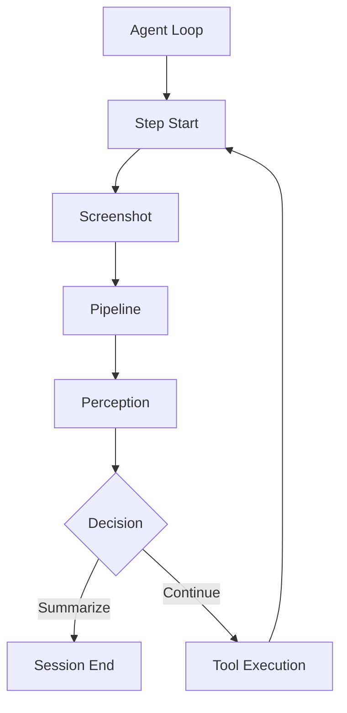

# 🤖 Computer Use Agent

A sophisticated AI agent designed to interact with computer interfaces through natural language commands. The agent combines computer vision, natural language processing, and decision-making capabilities to perform tasks on behalf of users.

## 🏗️ Architecture

### Core Orchestration

#### 1. Agent Loop (`agent/core/loop.py`)
- Main execution loop that orchestrates the entire workflow
- Manages the step-by-step execution of tasks
- Handles retries and error recovery
- Implements limits for steps, retries, and re-analysis attempts
- Coordinates the interaction between all components

#### 2. Context (`agent/core/context.py`)
- Maintains the state of the current session
- Tracks completed and failed steps
- Manages screen analysis and tool execution history
- Provides step management functionality
- Ensures continuity between steps

### Step Execution Flow

Each step in the agent's execution follows this sequence:



#### 1. Screenshot (`pipeline/screenshot.py`)
- Captures current screen state
- Manages screenshot storage and organization
- Handles multi-monitor support
- Provides timestamped image files
- Ensures consistent image capture for analysis

#### 2. Pipeline (`pipeline/pipeline.py`)
- Orchestrates the image processing workflow
- Integrates YOLO object detection
- Manages OCR text recognition
- Handles intelligent bbox merging
- Coordinates Seraphine geometric grouping
- Processes Gemini analysis results
- Generates structured screen analysis

#### 3. Perception (`agent/core/perception.py`)
- Analyzes screen state using the MCP server's Gemini analysis
- Identifies UI elements and their relationships
- Determines the current state of the task
- Routes between decision-making, re-analysis, or summarization
- Provides context-aware analysis

#### 4. Decision (`agent/core/decision.py`)
- Determines the next action based on perception analysis
- Selects appropriate tools for the task
- Generates tool parameters
- Handles error cases and recovery strategies
- Plans next steps

#### 5. Tool Execution
- Executes selected tools through MCP server
- Handles mouse and keyboard control
- Manages window operations
- Performs file operations
- Reports execution results

### Component Integration

The components work together in a tightly integrated workflow:

1. **Initialization**
   - Agent Loop creates a new session
   - Context is initialized with user query
   - Step counter and limits are set

2. **Step Execution**
   - Screenshot captures current state
   - Pipeline processes the image
   - Perception analyzes the results
   - Decision determines next action
   - Tool executes the action
   - Context updates with results

3. **Flow Control**
   - Perception can request re-analysis
   - Decision can trigger tool execution
   - Tool execution can lead to next step
   - Context maintains state throughout

4. **Completion**
   - Session summary is generated
   - Results are logged
   - Outputs are organized

### MCP Server Integration

The agent leverages the MCP (Multi-Computer Protocol) server which provides:

1. **Gemini Analysis**
   - Advanced UI element detection and recognition
   - Text extraction and understanding
   - Spatial relationship analysis
   - Element grouping and categorization

Reference to Pipeline with Gemini Analysis: 

2. **Tool Execution**
   - Mouse and keyboard control
   - Window management
   - Application launching
   - File operations

Reference to Windows Tool Execution MCP server: https://github.com/deepjyotisaha/eag14a/blob/master/computer_agent/src/windowManager/README.md


## 📁 Output Structure

The agent generates detailed outputs for each session:

```
outputs/
└── YYYY/
    └── MM/
        └── DD/
            └── session_YYYYMMDD_HHMMSS/
                ├── step_1/
                │   ├── screenshot_*.jpg
                │   └── pipeline_output.json
                ├── step_2/
                │   ├── screenshot_*.jpg
                │   └── pipeline_output.json
                └── session_summary.json
```

### Session Summary
- Complete task execution history
- Success/failure status
- Tool usage details
- Error information if any

## 🔄 Execution Flow

1. **Task Initialization**
   - User provides natural language task
   - Agent creates new session context
   - Initializes step counter and limits

2. **Perception-Analysis Cycle**
   - Takes screenshot of current state
   - Runs MCP pipeline for analysis
   - Processes Gemini analysis results
   - Updates context with findings

3. **Decision Making**
   - Analyzes current state
   - Selects appropriate tool
   - Generates tool parameters
   - Plans next steps

4. **Tool Execution**
   - Executes selected tool
   - Handles errors and retries
   - Updates context with results

5. **Completion/Summarization**
   - Generates session summary
   - Reports success/failure
   - Provides detailed execution history

## ⚙️ Configuration

### Agent Settings
```python
max_steps = 10      # Maximum steps per session
max_retries = 3     # Maximum retries per step
```

## 📝 Notes

- The agent uses a combination of computer vision and LLM analysis to understand the screen state
- Each step is carefully logged and can be reviewed in the session summary
- Error handling and recovery strategies are built into the execution flow
- The agent maintains context awareness throughout the task execution

## 🚀 Usage

### 🚀 Deploy MCP Mode (Production)

**Run:**
```bash
uv run mcp_server_windows.py
```

### 🐛 Run Computer Agent

```bash
uv run test_agent.py
```

---

**🚀 Ready to detect, group, and analyze! Happy coding!**

---


## 🤝 Contributing

Contributions are welcome! Please feel free to submit a Pull Request.

## 📄 License

This project is licensed under the MIT License - see the LICENSE file for details.

---

## 🙏 Acknowledgments

- 

---

## 📞 Support

For questions, issues, or contributions:
- **GitHub Issues**: [Create an issue](https://github.com/your-repo/issues)
- **Documentation**: This README
- **Examples**: See `examples/` directory


